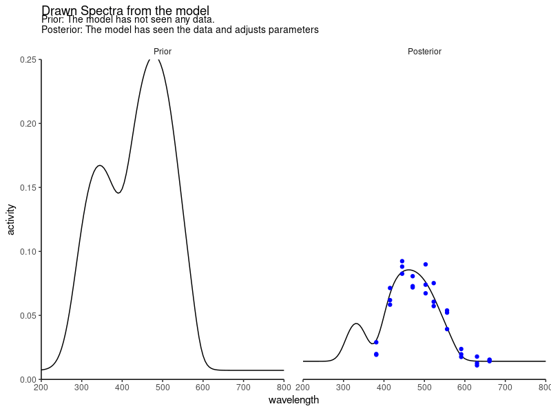
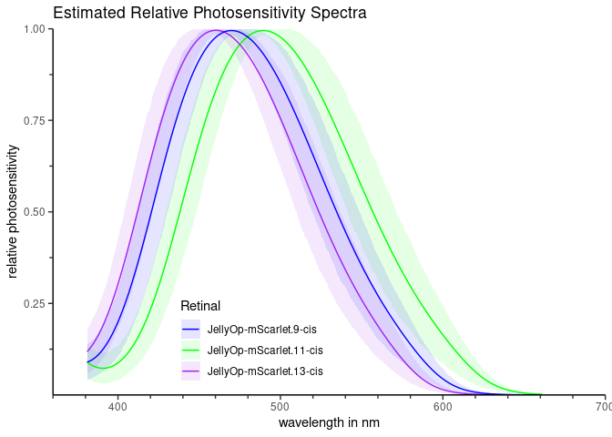
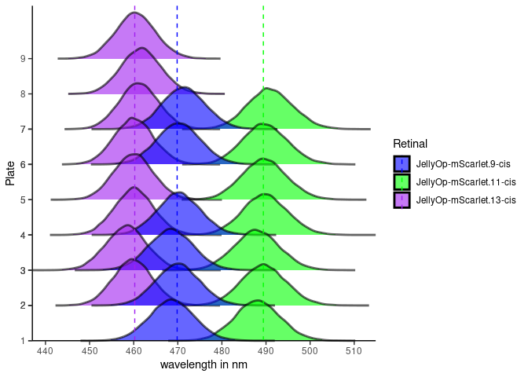

Vogt et al. 2024
================

## Description

This repository contains code to model functional activity of opsins
based on the spectral density template developed by Govardovskii et al.
Govardovskii et al. ([2000](#ref-govardovskii_search_2000)). The code
estimates spectral density in a Bayesian framework and incorporated
hierarchical experimental structure using *Stan* ([Carpenter et al.
2017](#ref-carpenter_stan_2017); [Stan Development Team
2023](#ref-stanManual)) via *cmdstanr* ([Gabry and Češnovar
2022](#ref-cmdstanrManual)).

The model takes spectral activity data and the corresponding
wavelengths, metadata (plate and experimental group) and estimates the
“relative photosensitivity” for every experimental group and plate.
Because it is a Bayesian model all parameters can also be used to
reproduce the expected spectral activity for any given wavelength
($\lambda$). In short, the model is used to fit spectral activity data
assuming the measurements are distributed as a $Gamma$-distribution
($activity_{p,g,\lambda} = Gamma(shape_{p,g}, \frac{shape_{p,g}}{\mu_{activity_{p,g,\lambda}}})$),
where $\mu_{activity}$ depends on the wavelength ($\lambda$), the
experimental group ($g$), and the partially the experimental plate
($p$). In contrast, the $shape$ parameter is assumed to be constant over
the wavelength ($\lambda$), but conditional on the experimental group
and plate. The possible differences between plates and groups reflect
the hierarchical structure of the experimental setup. Another crucial
parameter defining the location of the spectral peak is $\lambda_{max}$,
the peak of the $\alpha$-peak. However, as mentioned in Govardovskii et
al. ([2000](#ref-govardovskii_search_2000)) it does not reflect the
actual maximum of the spectrum. Depending on the other parameters in the
function differences between $\lambda_{max}$ and the actual peak
($\lambda_{peak}$) can be drastic. Hence, $\lambda_{peak}$ has to be
calculated after the estimation of the parameters by searching for the
maximum of the spectral function.

As we can see in the plot the model produces a wide range of possible
spectral activity lines when not having “seen” any data (“Prior”). If we
provide measurements the model will update its parameters to to explain
the data (“Posterior”). This results in the model estimating the 20,000
most probable spectra for each condition (experimental group and plate).
As we can see on the right side 5000 random draws of “mean-activity”
($\mu_{activity}$) (without measuring noise) follow the data well.



<!--  -->

The provided data points reduce the variance in possible spectra.
However, information in the $\beta$-band is still very limited leading
to a higher uncertainty in the estimates with a wavelength lower than
381 nm (see fluctuation in $\beta$-peak). The estimates for the region,
however, are informed by the relationship of the $\beta$- and
$\alpha$-peak as

By taking iterations of spectra at a given wavelength we can estimate
the highest density intervals (HDI) for the activity. These intervals
reflect the most probable activities given the wavelength, experimental
group and plate. If we were going to get more samples from this specific
experimental condition we would expect the data points to be within
these intervals. When looking at the estimated measurements (including
measurement noise) we can see that all the data points (blue) are within
our HDIs. These intervals represent the distribution of possible
spectral activities for any given wavelength.

<figure>

<figcaption aria-hidden="true">Spectral activity estimates for an
example experiment (plate and experimental group) with each 3
measurements at 10 different wavelengths. An additional dark activity
measurement was provided as input (not shown) to estimate the activity
without light activation. Light grey lines show the 80% HDI, fine dark
lines the 95% HDI, computed from the 20,000 draws of the posterior
distribution for spectral activity. The black dots indicate the
posterior mean.</figcaption>
</figure>

Since we estimate the relative photosensitivity as well we can be plot
it for different experimental groups and wavelength.

<!-- -->

Moreover, we estimate for any given experiment the peak location of the
spectral activity and as mentioned before this leads to 20,000 estimates
for any given combination (experimental group and plate). These draws
reflect the distribution of probable spectral peaks and give us a range
of the peaks with the uncertainty around the estimate. This uncertainty
reflects the uncertain information from the data set which can be due to
the amount of data provided or some unexplained variance.

<!-- -->

## Run the model

To run the model download the repository and set the working directory
in the `settings.R` file. Make sure that you adjust the number of cores
you want to use for your system `n_cores`. In this example we will use
10 cores and run 5 chains in parallel. The model will draw 20,000
samples from the posterior distribution. If you have less than 5 cores
available you can reduce also the number of parallel chains
(`n_chains`). Running the model on your machine can take some time. Be
aware that in the current state the estimation is computationally
intensive and can depending on the size of the data set take several
hours. The simple data set analysing the different retinals (as shown
here), however, will take roughly 20 minutes.

``` r
project_path <- "/user/Vogt-et-al-2024/" # path of project
n_cores <- 10 # number of cores to use for parallel processing
n_chains <- 5 # number of parallel chains (each on one CPU thread) for model
n_samples <- 20000 # number of samples to draw from posterior distribution
```

<div id="refs" class="references csl-bib-body hanging-indent"
entry-spacing="0">

<div id="ref-carpenter_stan_2017" class="csl-entry">

Carpenter, Bob, Andrew Gelman, Matthew D. Hoffman, Daniel Lee, Ben
Goodrich, Michael Betancourt, Marcus Brubaker, Jiqiang Guo, Peter Li,
and Allen Riddell. 2017. “Stan: A Probabilistic Programming Language.”
*Journal of Statistical Software* 76 (1): 1–32.
<https://doi.org/10.18637/jss.v076.i01>.

</div>

<div id="ref-cmdstanrManual" class="csl-entry">

Gabry, Jonah, and Rok Češnovar. 2022. *Cmdstanr: R Interface to
’CmdStan’*. [https://mc-stan.org/cmdstanr/,
https://discourse.mc-stan.org](https://mc-stan.org/cmdstanr/, https://discourse.mc-stan.org).

</div>

<div id="ref-govardovskii_search_2000" class="csl-entry">

Govardovskii, Victor I., Nanna Fyhrquist, Tom Reuter, Dmitry G. Kuzmin,
and Kristian Donner. 2000. “In Search of the Visual Pigment Template.”
*Visual Neuroscience* 17 (4): 509–28.
<https://doi.org/10.1017/S0952523800174036>.

</div>

<div id="ref-stanManual" class="csl-entry">

Stan Development Team. 2023. *Stan Modeling Language Users Guide and
Reference Manual*. <https://mc-stan.org>.

</div>

</div>
